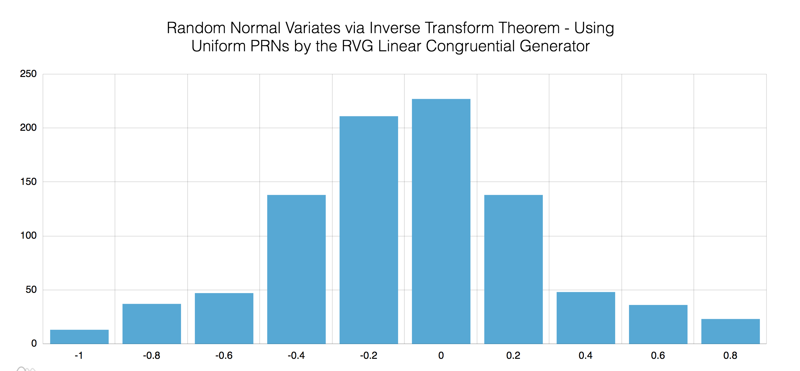

# Random Variate Generator Example

This is an example of how to use the [Random Variate Generation Module](https://github.com/bestickley/random-variate-generators).

Run npm run-script start to see a few demonstratory samples (powered by [amcharts](https://www.amcharts.com/docs/v4/)).
##  Normal Distribution using RVG

